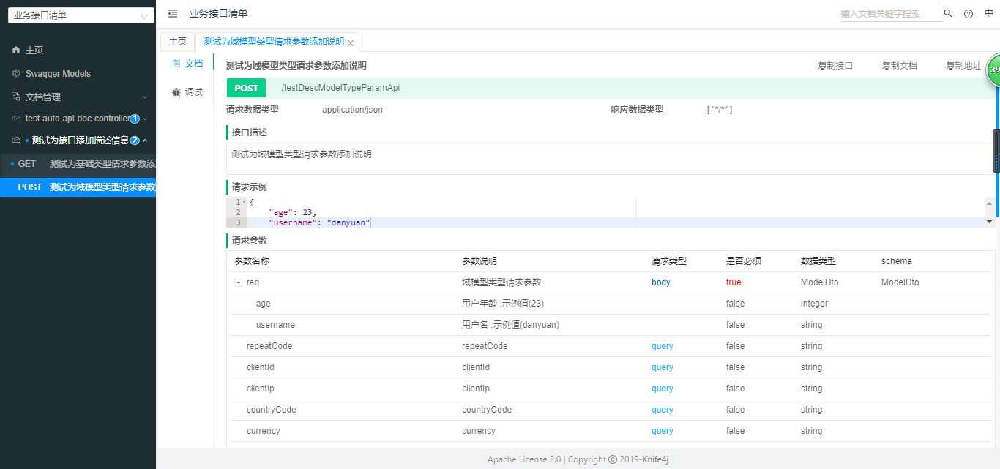

<center><h1>Popular MVC框架swagger接口文档工具使用示例</h1></center>

# 简介
> 此项目介绍如何使用popularmvc内置的swagger+knife4j实现简单易用的实时API文档，支持在线调试接口！
>
> 此项目只演示简单入门示例，更多接口文档使用细节请求参考swagger和knife4j官方文档!

* [demo源码传送门](../../popular-web-mvc-simple-demos/api-doc-demo)

# 项目示例

## 1 项目结构

* 项目结构

    ```ruby
    ├─src
    │  └─main
    │     └─java
    │       └─com
    │           └─danyuanblog
    │               └─framework
    │                   └─demo
    │                       └─popularmvc
    │                           ├─controller
    │                           │  │  
    │                           │  │  ModelDto.java
    │                           │  │  
    │                           │  │  TestAutoApiDocController.java
    │                           │  │  
    │                           │  │  TestDecorateApiDocController.java
    │                           │  │  
    │                           │  └─ TestIgnoreApiDocController.java
    │                           │          
    │                           └─startup
    │                                   StartDemoApplication.java #项目启动类
    └─  pom.xml
    
    ```

* 引入模块依赖，在`pom.xml`添加

```xml
	<dependency>
		<groupId>com.danyuanblog.framework</groupId>
		<artifactId>popular-web-mvc</artifactId>
		<version>${popular-web-mvc.version}</version>
	</dependency>
```

## 2 启用PopularMvc框架

```java
/**  
* Title StartDemoApplication.java  
* Description  
* @author danyuan
* @date Oct 31, 2020
* @version 1.0.0
* site: www.danyuanblog.com
*/ 
package com.danyuanblog.framework.demo.popularmvc;

import org.springframework.boot.SpringApplication;
import org.springframework.boot.autoconfigure.SpringBootApplication;
import com.danyuanblog.framework.popularmvc.annotation.EnablePopularMvc;

@SpringBootApplication
@EnablePopularMvc
public class StartDemoApplication {

	public static void main(String[] args) {
		SpringApplication.run(StartDemoApplication.class, args);
	}
}

```

## 3 接口文档示例

### 3.1 不添加任何注释的接口文档

> popularmvc会自动为你生成接口文档

* 接口源码`TestAutoApiDocController.java`

    ```java
    /**  
    * Title TestAutoApiDocController.java  
    * Description  测试自动生成的接口文档
    * @author danyuan
    * @date Dec 27, 2020
    * @version 1.0.0
    * site: www.danyuanblog.com
    */ 
    package com.danyuanblog.framework.demo.popularmvc.controller;
    
    
    import org.springframework.web.bind.annotation.GetMapping;
    import org.springframework.web.bind.annotation.PathVariable;
    import org.springframework.web.bind.annotation.RequestParam;
    import org.springframework.web.bind.annotation.RestController;
    
    @RestController
    public class TestAutoApiDocController {
    	
    	@GetMapping("{age}/testNoDescApi")
    	public String testNoDescApi( @RequestParam(required = false) String username
    			, @PathVariable Integer age){
    		return "测试无接口注释时自动生成的接口文档!";
    	}
    }
    ```

### 3.2 屏蔽某些接口文档

> popularmvc提供了注解忽略某些接口，使其不展示在接口文档中，但是你仍然可以访问这部分接口。

* 接口源码`TestIgnoreApiDocController.java`

    ```java
    /**  
    * Title TestIgnoreApiDocController.java  
    * Description  测试不展示的接口文档，但是接口是可用的，
    * 只是不接口文档中不显示而已，一些不希望暴露给使用者调用的接口可以使用此方式。
    * @author danyuan
    * @date Dec 27, 2020
    * @version 1.0.0
    * site: www.danyuanblog.com
    */ 
    package com.danyuanblog.framework.demo.popularmvc.controller;
    
    
    import org.springframework.web.bind.annotation.GetMapping;
    import org.springframework.web.bind.annotation.RestController;
    
    import springfox.documentation.annotations.ApiIgnore;
    
    @RestController
    @ApiIgnore
    public class TestIgnoreApiDocController {
    	
    	@GetMapping("testInnerApi")
    	public String testInnerApi(){
    		return "调用内部隐私接口成功!";
    	}
    }
    ```

    

### 3.3 为接口添加额外的描述信息

> 你可以为你的接口添加说明信息，以便于使用者更清晰的知道接口的意图。

* 源码`TestDecorateApiDocController.java`

    ```java
    /**  
    * Title TestDecorateApiDocController.java  
    * Description  测试为接口添加描述信息
    * @author danyuan
    * @date Dec 27, 2020
    * @version 1.0.0
    * site: www.danyuanblog.com
    */ 
    package com.danyuanblog.framework.demo.popularmvc.controller;
    
    
    import io.swagger.annotations.Api;
    import io.swagger.annotations.ApiImplicitParam;
    import io.swagger.annotations.ApiImplicitParams;
    import io.swagger.annotations.ApiOperation;
    
    import org.springframework.web.bind.annotation.GetMapping;
    import org.springframework.web.bind.annotation.PostMapping;
    import org.springframework.web.bind.annotation.RequestBody;
    import org.springframework.web.bind.annotation.RequestParam;
    import org.springframework.web.bind.annotation.RestController;
    
    @RestController
    @Api(tags = "测试为接口添加描述信息")
    public class TestDecorateApiDocController {
    	
    	@GetMapping("testDescBaseTypeParamApi")
    	@ApiOperation(value="测试为基础类型请求参数添加说明", notes="测试为基础类型请求参数添加说明")
    	@ApiImplicitParams({
    		@ApiImplicitParam(name = "username", value = "用户名", required = false, defaultValue = "danyuan"),
    		@ApiImplicitParam(name = "age", value = "年龄", required = true, defaultValue = "23"),
    		 })
    	public String testDescBaseTypeParamApi( 
    			@RequestParam(required = false) String username
    			, @RequestParam Integer age){
    		return "测试为基础类型请求参数添加说明!";
    	}
    	
    	@PostMapping("testDescModelTypeParamApi")
    	@ApiOperation(value="测试为域模型类型请求参数添加说明", notes="测试为域模型类型请求参数添加说明")
    	public String testDescModelTypeParamApi(@RequestBody ModelDto req){
    		return "测试为域模型类型请求参数添加说明！";
    	}
    }
    ```

* 源码`ModelDto.java`

    ```java
    /**  
    * Title ModelDto.java  
    * Description  
    * @author danyuan
    * @date Dec 30, 2020
    * @version 1.0.0
    * site: www.danyuanblog.com
    */ 
    package com.danyuanblog.framework.demo.popularmvc.controller;
    
    import io.swagger.annotations.ApiModel;
    import io.swagger.annotations.ApiModelProperty;
    
    import java.io.Serializable;
    
    import javax.validation.constraints.NotNull;
    
    import lombok.Data;
    
    @Data
    @ApiModel(description="域模型类型请求参数")
    public class ModelDto implements Serializable{/** 
    	 *serialVersionUID
    	 */
    	private static final long serialVersionUID = 1L;
    	
    	@ApiModelProperty(
    			required=false,
    			allowEmptyValue=false,
    			notes="用户名",
    			example="danyuan"
    			)
    	private String username;
    	
    	@ApiModelProperty(
    			required=false,
    			allowEmptyValue=false,
    			notes="用户年龄",
    			example="23"
    			)
    	@NotNull
    	private Integer age;
    }
    ```


# 结果示例



